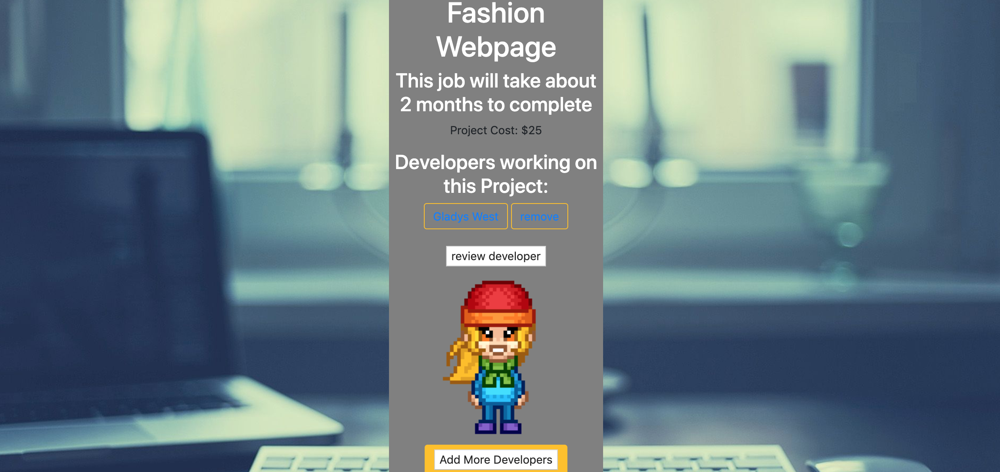

## Developedia `Updated 12.25.2019` [VIDEO](https://youtu.be/9RpBgMKWtDw) [LIVE DEMO - Heroku](https://developedia-app.herokuapp.com/)

Developedia app gives you the power to find the right developer (with right tech skills) for your project in minutes. We have a full user authentication and all the functionality to create a new project inside an app, find a developer, check his/her skills, hire, see the budget and write a review.

### `Goals of this project`

1. Master Ruby on Rails skills (MVC, Serializer, Auth).
2. Train CSS skills.

### `Tech stack`

1. Whole app is build with Ruby on Rails.
2. Views mostly styled with vanilla CSS + Bootsrap for buttons.

### `Run this App`

1. To run the App you need to clone this repo and choose any port (http://localhost:3003)
2. Rails part built on top of PostgreSQL.

### ` What you can do on the Developedia page?`

### `Thanks`

Special thanks to my project partner - [Emmanuel Owusu](https://github.com/emanovic7).

Thank you [Annie Souza](https://github.com/luanesouza), [Randy Herasme](https://github.com/randyher) for support, professionalism and patience. Thank you for seeing me and every student as a partner in learning and sharing.
